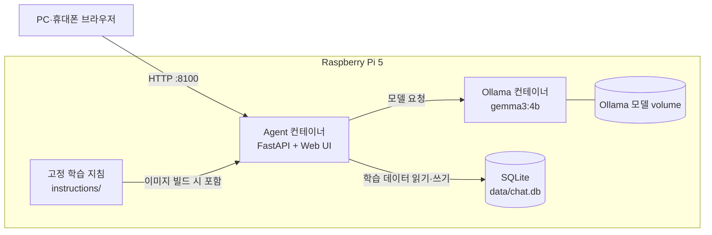
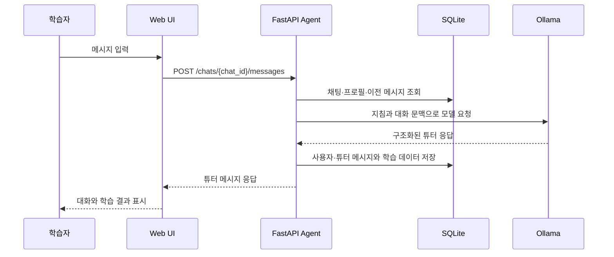
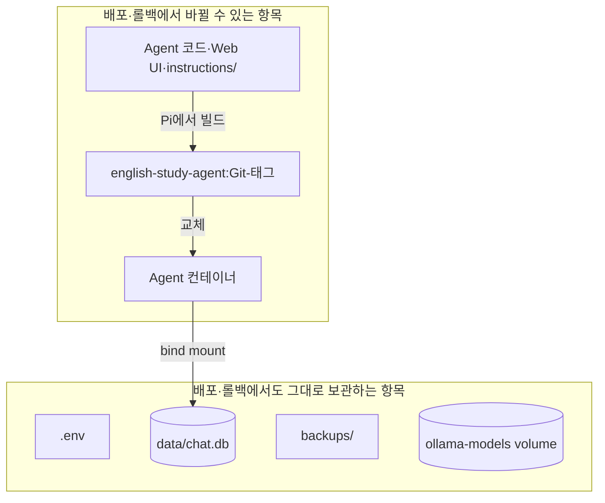

# English Study AI

Raspberry Pi 5에서 개인적으로 사용하는 영어 학습 챗봇입니다. 브라우저에서 대화하며 학습을 진행하고, 학습 프로필·대화·복습 단어·학습 이력을 SQLite에 저장합니다. Python Agent는 Ollama의 로컬 모델과 대화하고, Web UI와 API를 함께 제공합니다.

현재 기본 모델은 `gemma3:4b`이며, Agent는 Pi의 LAN 포트 `8100`으로만 공개합니다.

## 주요 기능

- 날짜별 기본 학습 채팅과 같은 날의 추가 학습 채팅
- 초기 실력 테스트 14문항을 통한 학습 프로필 생성
- 대화 중 학습 이력과 복습할 단어·표현 저장
- 최근 학습 이력과 복습 목록을 보는 학습 화면
- Ollama·Agent를 분리한 Docker Compose 실행
- 개발 PC에서 테스트 후 `rsync`로 소스를 전송하고 Pi에서 Agent 이미지를 빌드하는 배포
- Git 커밋 태그를 이용한 Agent 단독 롤백

## 전체 구성



브라우저는 Agent에만 연결합니다. Ollama의 `11434` 포트는 Pi 외부에 공개하지 않으며, Agent 컨테이너가 Compose 내부 네트워크를 통해서만 Ollama에 요청합니다.

## 학습 요청의 흐름



Agent는 시작할 때 `instructions/`의 튜터 지침, 학습 가이드라인, 초기 실력 테스트 지침을 읽습니다. 모델 응답은 Python에서 검증한 뒤 학습 데이터로 저장합니다. Ollama 또는 모델에 연결할 수 없으면 API는 `503`, 모델 응답을 처리하지 못하면 `502`를 반환합니다.

## 데이터와 이미지의 경계



| 항목 | 역할 | 배포·롤백 시 처리 |
| --- | --- | --- |
| `instructions/` | 고정 튜터 지침 | Agent 이미지에 포함되어 코드와 함께 변경·롤백 |
| `data/chat.db` | 채팅·프로필·학습 데이터 | 전송·삭제·변경하지 않음 |
| `backups/` | 사용자가 만든 SQLite 백업 | 전송·삭제·변경하지 않음 |
| `.env` | Pi별 모델·시간대·대기 시간 설정 | 전송·삭제·변경하지 않음 |
| `ollama-models` volume | 내려받은 Ollama 모델 | Agent 교체와 무관하게 유지 |

## 실행 환경

| 구성 요소 | 사용 기술 |
| --- | --- |
| API·Agent | Python 3.13, FastAPI, Pydantic, HTTPX |
| LLM | Ollama, `gemma3:4b` 기본값 |
| 저장소 | SQLite |
| Web UI | HTML, CSS, JavaScript |
| 운영 | Docker Compose, Raspberry Pi OS ARM64 |
| 배포 | `rsync`, SSH, Pi 로컬 Docker 빌드 |

## 설정

Pi의 `.env`에서 실행 환경을 설정합니다. `.env.example`을 바탕으로 만들며 Git과 배포 전송 대상에 포함하지 않습니다.

```dotenv
MODEL=gemma3:4b
OLLAMA_KEEP_ALIVE=30m
OLLAMA_TIMEOUT_SECONDS=60
TIMEZONE=Asia/Seoul
```

`OLLAMA_KEEP_ALIVE`는 모델을 메모리에 유지하는 시간이고, `OLLAMA_TIMEOUT_SECONDS`는 모델 응답을 기다리는 최대 시간(초)입니다.

## Pi에서 직접 빌드·실행

Pi에 소스와 `.env`, 모델이 이미 준비되어 있다면 다음 명령으로 현재 Pi의 소스에서 이미지를 만들고 컨테이너를 시작할 수 있습니다.

```bash
cd /home/<Pi 사용자명>/english_study_ai
export AGENT_TAG="manual-$(date +%Y%m%d-%H%M%S)"
AGENT_TAG="$AGENT_TAG" docker compose up -d --build
```

상태 확인:

```bash
docker compose ps
curl -fsS http://127.0.0.1:8100/health
```

이미 만들어진 컨테이너가 중단된 경우에는 이미지를 다시 빌드하지 않고 다음 명령으로 시작합니다.

```bash
docker compose start ollama agent
```

수동 빌드에 사용한 `manual-*` 태그와 그 밖의 Git SHA가 아닌 Agent 태그는 개발 PC 배포 도구의 롤백 기록에 포함되지 않습니다. 이후 개발 PC 배포 도구를 실행하면 해당 Agent는 새 Git SHA 이미지로 교체되고, 이전 태그는 `none`으로 기록됩니다.

## 개발 PC에서 Pi로 배포

개발 PC의 배포 도구는 Python·Web 테스트와 clean Git 상태를 확인한 뒤, Docker 빌드에 필요한 실행 파일만 Pi로 전송합니다. Pi에서 현재 Git 커밋의 12자리 SHA를 태그로 Agent 이미지를 빌드하고 Agent 컨테이너만 교체합니다.

```bash
./scripts/deploy_to_pi.sh <Pi-SSH-대상> /home/<Pi 사용자명>/english_study_ai
```

직전 Git 태그의 Agent 이미지로 돌아가려면 다음 명령을 사용합니다.

```bash
./scripts/rollback_to_pi.sh <Pi-SSH-대상> /home/<Pi 사용자명>/english_study_ai
```

최초 설정, 모델 다운로드, 보안 경계, 수동 복구 방법은 [운영 문서](docs/operations.md)를 참고합니다.

## 테스트

개발 PC에서 다음 명령으로 Python과 Web 테스트를 실행합니다.

```bash
(cd backend && ../.venv/bin/python -m pytest)
npm --prefix web test
```

배포 도구도 같은 테스트를 먼저 실행하며, 테스트 또는 Git 상태 확인이 실패하면 Pi로 파일을 전송하지 않습니다.

## 프로젝트 구조

```text
backend/          FastAPI API, Agent, SQLite 접근, Ollama 클라이언트
web/              브라우저 UI와 Web 테스트
instructions/     Agent 이미지에 포함되는 고정 학습 지침
data/             Pi에서 계속 보관하는 SQLite 데이터
backups/          사용자가 관리하는 SQLite 백업
scripts/          개발 PC에서 실행하는 배포·롤백 도구
compose.yaml      Ollama와 Agent 컨테이너 정의
Dockerfile        Agent 이미지 빌드 정의
docs/             상세 운영 문서
```

## 운영 원칙

- Agent는 비루트 사용자와 읽기 전용 파일시스템으로 실행합니다.
- SQLite가 있는 `data/`만 Agent에 쓰기 가능한 bind mount로 연결합니다.
- Ollama는 Compose 내부에서만 접근하고, Agent의 `8100` 포트만 LAN에 공개합니다.
- `.env`, SQLite 데이터·백업, Ollama 모델 volume은 배포·롤백에서 건드리지 않습니다.
- 컨테이너 이미지 레지스트리와 GitHub Actions 기반 배포는 MVP 이후에 검토합니다.
